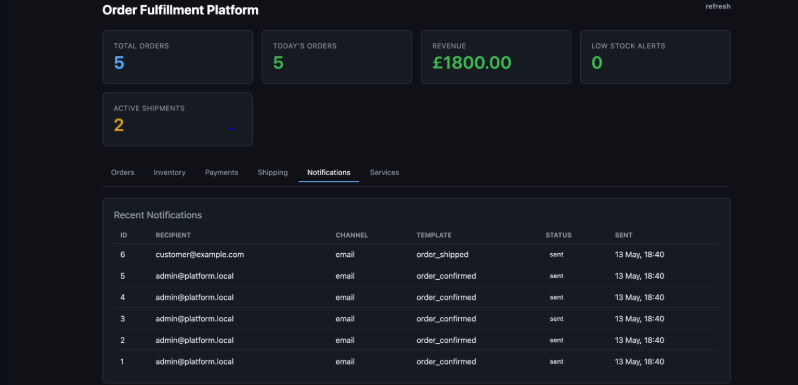
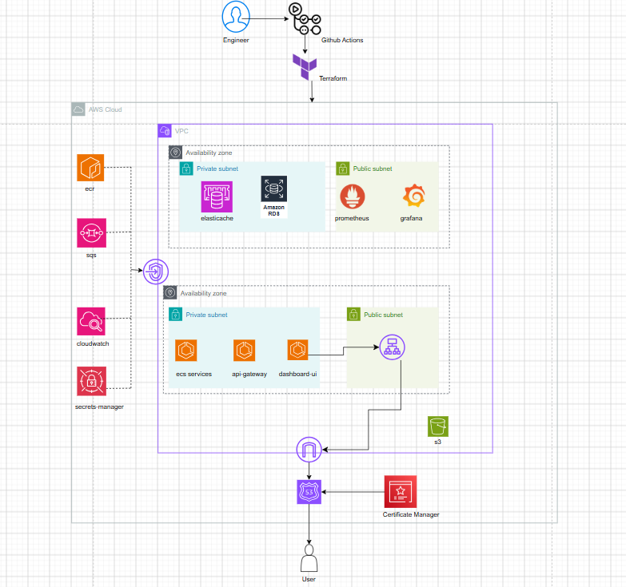
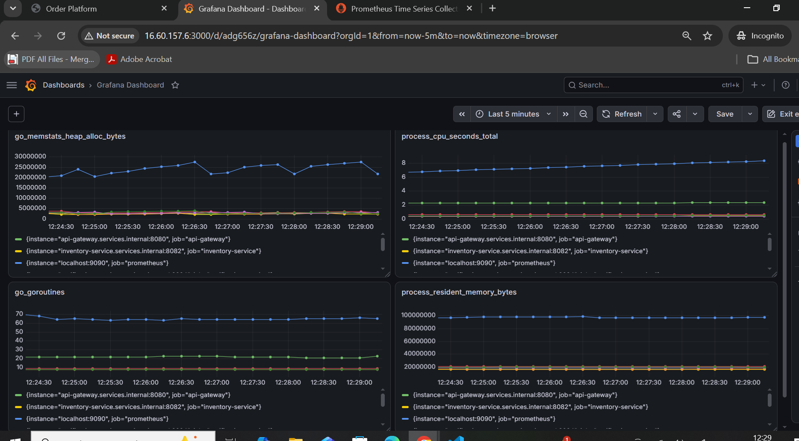
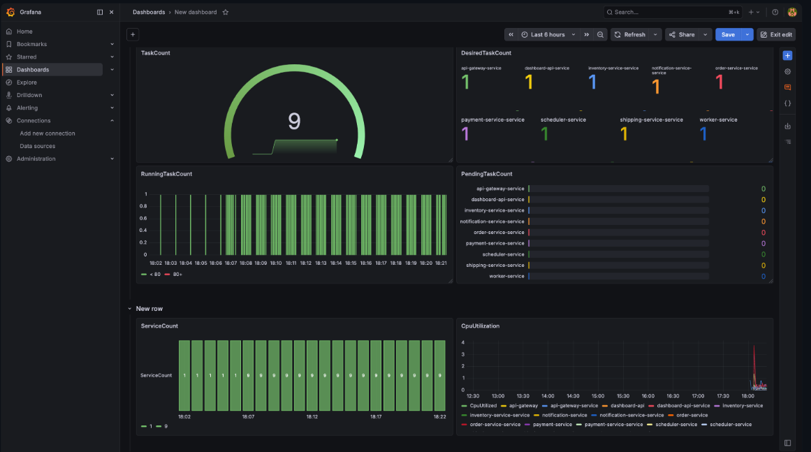

# Order Fulfillment Platform hosted on AWS ECS FARGATE

A production-style order management platform built on AWS ECS Fargate, composed of Go microservices communicating synchronously via an API gateway and asynchronously through SQS event-driven workflows. Infrastructure is fully provisioned with Terraform, deployments are automated end-to-end via GitHub Actions, and the platform is monitored through a Prometheus and Grafana observability stack.



---

## Overview

The platform runs nince microservices (api-gateway, dashboard-api, inventory-service, notification-service, order-service, payment-service, scheduler, shipping-service, worker ) across a fully automated infrastructure pipeline with:

- **Infrastructure** Deployed using Terraform
- **GitOps deployments** driven by ArgoCD
- **Full observability** with Prometheus, Grafana


---

## Architecture



---

## Technology Stack

| Category | Technology |
|---|---|
| **Cloud** | AWS (ECS, ECR, Route 53, Secrets Manager, VPC, Elasticache, SQS,EC2) |
| **Infrastructure as Code** | Terraform |
| **Container Orchestration** | AWS ECS FARGATE |
| **Observability** | Prometheus, Grafana |
| **Certificate Management** | ACM |
| **DNS Management** | Route53 |
| **Secrets Management** |  AWS Secrets Manager |
| **Image Registry** | Amazon ECR |

---

## Project Structure

```
ecs-v3/
├── .github/
│   └── workflows/
│       ├── push.yml         
│       └── terraform.yml           
├── README.md
├── images/                           
├── services/
└── terraform/
    ├── environments/
    │   ├── dev/
    │   ├── prod/ 
    ├── bootstrap/
    │   ├── main.tf                
    │   ├── variables.tf
    │   └── outputs.tf
    ├── modules/
    │   ├── vpc/                    
    │   ├── sqs/                
    │   ├── ecs/                   
    │   ├── rds/                  
    │   ├── acm/            
    │   ├── alb/         
    │   ├── iam/           
    │   ├── observability/             
    │   ├── elasticache/                                 
    ├── providers.tf
```

---

## Getting Started

### Prerequisites

- AWS CLI configured with appropriate credentials
- Terraform >= 1.5
- Docker Engine (local deployment only)

### Run Locally

```bash
git clone https://github.com/MubashirHusain2005/ecs-v3
cd ecs-v3/services
docker compose up -d
```

### Deploy to AWS

**1. Bootstrap remote state**

```bash
cd terraform/bootstrap
terraform init && terraform plan && terraform apply
```

Provisions the S3 bucket for Terraform remote state, ECR repositories, IAM roles, a KMS key for ECR encryption, and the GitHub OIDC provider for CI/CD access to AWS.

**2. Deploy infrastructure**

Choose the environment you want to deploy (`dev` or `prod`):

```bash
cd terraform/environments/dev
terraform init && terraform plan && terraform apply
```

For production:

```bash
cd terraform/environments/prod
terraform init && terraform plan && terraform apply
```
## Terraform Modules

### VPC

Provisions the network foundation for the ECS cluster.

- **Internet Gateway** for inbound public traffic to the ALB
- **No NAT Gateway** — private subnets have no internet route at all; outbound access (ECR pulls, CloudWatch logs, Secrets Manager, SQS) is handled entirely through VPC endpoints instead, avoiding NAT data-processing costs
- **VPC Endpoints**: S3 (Gateway), ECR API, ECR Docker, CloudWatch Logs, SQS, and Secrets Manager (Interface, read-only policy)
- Private subnets host the ECS tasks, RDS PostgreSQL, and ElastiCache
- VPC Flow Logs shipped to CloudWatch for network audit


### IAM

Defines least-privilege(ish) roles for ECS tasks, VPC Flow Logs, and the observability EC2 instance.

- **ECS Task Execution Role** — pulls container images from ECR, writes logs to CloudWatch, resolves Cloud Map service discovery, and reads task secrets from Secrets Manager
- **ECS Task Role** — assumed by the running application; grants CloudWatch Logs, Secrets Manager, SQS consumption, and read-only SSM access
- **VPC Flow Logs Role** — scoped to just the CloudWatch Logs actions needed to ship flow log data
- **Monitoring Role** — attached to the Prometheus/YACE EC2 instance; grants CloudWatch and ECS read access (for metrics scraping) plus SSM Session Manager access for shell-free instance management
---

### ECS

Runs all 9 services as independent Fargate tasks behind Cloud Map service discovery, with automatic rollback on failed deployments.

- **Cluster**: single ECS cluster (`ecs-cluster`) with Container Insights enabled
- **Cloud Map**: private DNS namespace (`services.internal`) — each service registers as `<service-name>.services.internal`, used for internal service-to-service calls (API Gateway → downstream services) instead of hardcoded IPs
- **Public-facing services** (`api-gateway`, `dashboard-api`) sit behind the ALB via target groups; all other services are reached only through Cloud Map
- **Deployment safety**: every service uses `deployment_circuit_breaker` with automatic rollback — if a new task definition fails health checks and can't stabilize, ECS reverts to the last healthy revision on its own. `deployment_minimum_healthy_percent = 100` / `maximum_percent = 200` ensures old tasks stay up until new ones pass health checks, so a bad deploy never causes downtime
- **Logging**: each service ships to its own CloudWatch log group (`/ecs/<service>`, 7-day retention)
- **Secrets**: task-level secrets (JWT, database URL) are injected via Secrets Manager, never hardcoded

---

### SQS

Async messaging backbone for order processing, with dead-letter handling for failed messages.

- **Main queue** — receives order events; messages that fail processing after a configurable number of attempts (`sqs_max_receive_count`) are automatically redirected to the dead-letter queue
- **Dead-letter queue** — retains failed messages for 14 days for debugging/replay, restricted so only the main queue can redrive messages into it
- Both queues use SQS-managed server-side encryption
---

### Observability

Two standalone EC2 instances run the monitoring stack, separate from the ECS cluster so metrics collection isn't affected by application deploys.

- **Prometheus + YACE** (one instance) — Prometheus scrapes each of the 9 ECS services directly via Cloud Map DNS (`<service>.services.internal`), and scrapes YACE separately to pull AWS CloudWatch metrics (ECS CPU/memory/task counts) into the same Prometheus store

- **Grafana** (separate instance) — connects to Prometheus as its datasource, added manually post-deploy since the two instances don't share Terraform state dependencies
- Both instances run Ubuntu 22.04, provisioned via a shared `deployer-key` SSH key pair, with all services running as Docker containers via `docker-compose`




---

### ACM

Maps the domain onto the ALB and provisions a TLS certificate, fully automated end-to-end.

- **Route 53** — apex (`mubashir.site`) and `www` A records alias directly to the ALB, so no additional DNS hop or hosted CNAME target is needed
- **ACM** — certificate covers both the apex domain and `www` subdomain via `subject_alternative_names`, validated automatically through DNS (no manual click-to-validate step)
- Validation records are created and confirmed entirely in Terraform, so `terraform apply` doesn't complete until the certificate is actually issued and ready to attach to the ALB's HTTPS listener
---

### Elasticache

Provisions Redis for rate limiting in the API Gateway.

- Single-node `cache.t3.micro` cluster running Redis 7.0
- Sits in the private subnets, reachable only from the ECS task security group on port 6379
- Used by `api-gateway` for request rate limiting, with a retry/backoff pattern in the Go client to handle cold-start connectivity gaps

---

### RDS


Provisions the PostgreSQL database backing dashboard-api and the other data-consuming services.

- Single PostgreSQL 18.4 instance, private-only (no public accessibility), storage-encrypted at rest
- Security group restricts inbound 5432 to the ECS task security group only
- Credentials are generated via `random_password` and stored in Secrets Manager as a connection URL, with the password URL-encoded to safely handle special characters
- `multi_az` and `skip_final_snapshot` are environment-driven — disabled in dev, intended to be enabled in prod for high availability and safe teardown


---

### ALB

Single Application Load Balancer handling all public traffic, with HTTPS enforced and path-based routing to the two internet-facing services.

- **HTTP → HTTPS redirect** — port 80 always 301s to 443, no plaintext traffic served
- **HTTPS listener** — terminates TLS using the ACM certificate, defaults to a 404 fixed-response for any unmatched path
- **Path-based routing**:
  - `/api*`, `/auth/*`, `/healthz` → api-gateway (priority 100)
  - `/`, `/dashboard`, `/dashboard/*`, `/healthz` → dashboard-api (priority 90)
- Target groups use IP-based targeting (required for Fargate), with health checks on each service's `/healthz` endpoint
- Only the ALB is publicly reachable — all other services communicate internally via Cloud Map, never through the load balancer

---

## Stats

- **25% reduction** in deployment time via CI/CD pipelines
- **50% reduction** in image size using multi-stage builds and Alpine base images
- **Dashboards**  for all services to understand application metrics 

---

## Planned Improvements

- [ ] Run all containers as non-root users to reduce attack surface
- [ ] AWS WAF on the ALB
- [ ] Include potential use of Kafka over SQS

## Created BY: MUBASHIR